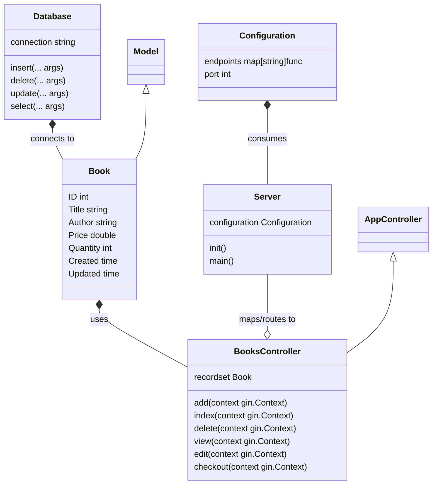

# 🧑🏽‍💻 Project `bookshop`
This project intents to be an example to use it as a playground for an API development of a book shop implemented in Golang.

## ☑️ Requirements
The API should be able to manage a database for the books in the store. Allowing the user to perform following operations:
 * **List all the books.** It should return the list of all books in the store.
 * **Create a book.** It should insert a new record of the book provided by the user.
 * **Update a book.** It should allow the user to update the information of a given book.
 * **Delete a book.** It should allow the user to remove a specific book record from store.
 * **View book details.** It should show the details of a single book provided by the user.
 * **Checkout a book.** It should decrease the quantity of a book record if it's available.

## 📚 Books
That database should have a table that contains following data:

| Name       |     Type      | Description                                 |
| :---       |    :----:     | :---                                        |
| `id`       | `INT(10)`     | Autonumeric identifier for the book         |
| `title`    | `VARCHAR(30)` | Title of the book                           |
| `author`   | `VARCHAR(30)` | Author of the book                          |
| `price`    | `DOUBLE`      | Price of the book                           |
| `quantity` | `INT(5)`      | Amount of book copies in the store          |
| `created`  | `DATETIME`    | Timestamp representing the creation time    |
| `updated`  | `DATETIME`    | Timestamp representing the last update time |

## 📐 Design
The architecture will be a HTTP microservice that will consume some configuration and use ORM to represent the records in the database tables and also a Model-Controller (MC) pattern design, so the controllers will contain the handlers for the API requests, while the models will manage the data and connect to the database.

## 🏗️ Implementation details
We are using Golang as programming language for the implementation of the API operations. And the database is a single table in SQLite stored locally.
### 📦 Dependencies
We are using following libraries for the implementation:
 * **`gin-gonic`.** A web framework to implement a RESTful API via HTTP.
 * **`gorm`.** A library for Object Relational Model (ORM) in order to represent the records in the database as relational objects.
 * **`gorm` SQLite driver.** The database is a local storage implementing `SQLite`, so we need a wait to connect to it.
 * **`godotenv`.** This library allows us to load environment configuration via `.env` files.
 * **`crypto/bcrypt`.** To make use of `base64` encoding and decoding for the authentication token.
 * **`golang-jwt`.** To generate and use JSON Web Tokens (JWT) for authentication and authorisation.

And also, following ones for the development:
 * **`testify`.** To have more readable assertions on the unit testing.
 * **`mockery`.** To generate mocks used on unit testing.

 ## 🤔 Assumptions
This is a small example and it's not taking care about some coner case scenaries like following:
 * Raise conditions while checking out the books.
 * Manage normalised author names in separate table to avoid duplications.
 * Details about the purchase while checking out.
